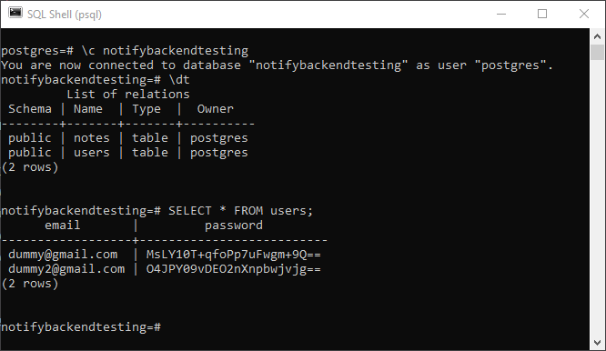

# NotifyBackend
Github repository for the Notify project backend. Built using Spring boot.
## REST-Api Documentation

---


### _User object example in JSON:_
```json
{  
  "email" : "dummyemail@gmail.com",  
  "password" : "dummypassword"  
}
```
### _Note object example in JSON:_
```json 
{
  "title": "dummyNote",  
  "body": "This is some body text for the note",  
  "created": "2022-04-14T13:34:00",   
}
```
### _Cookie object example in JSON:_
```json 
{
    "name": "userId",
    "value": "dummy@gmail.com",
    "version": 0,
    "comment": null,
    "domain": "localhost",
    "maxAge": -1,
    "path": "/",
    "secure": false,
    "httpOnly": true
}
```

## How to run the backend locally with PostgreSql:
### Step 1.

---
[Download and install PostgreSql.](https://www.enterprisedb.com/downloads/postgres-postgresql-downloads) Make sure to remember the details used during the installation process.  
This information will  be used later to connect your database to the Spring boot application. You can check   
your current PostgreSql version by typing "psql --version" in the command line.
### Step 2.

---
Open "SQL shell" on you computer. Press enter four times for server, database, port and username. Enter  
your chosen password during the installation if required. Once logged in create a local database using:
```postgresql
CREATE DATABASE nameOfYourDatabase;
```


### Step 3. 

---
Clone this project using the link: https://github.com/Lukkah123/NotifyBackend.git  
The project already contains the required PostgreSql dependency:
```xml
<dependency>
    <groupId>org.postgresql</groupId>
    <artifactId>postgresql</artifactId>
    <scope>runtime</scope>
</dependency>
```
### Step 4.

---
Add the following to the application.properties file to connect the Spring boot application to your database:
```properties
spring.datasource.url=jdbc:postgresql://localhost:5555/myDatabase
spring.datasource.username=postgres
spring.datasource.password=mySecretPassword
spring.jpa.database-platform=org.hibernate.dialect.PostgreSQLDialect
spring.jpa.hibernate.ddl-auto=update
```
NOTE:  
Replace the number 5555 with the port your PostgreSql database is running on and myDatabase with  
the name of your local database that you created in step 2.  

The application is now connected to your local PostgreSql database.

### Step 5. (Optional)

---
If you want to view the contents of the PostgreSql database directly this can be accomplished using the   
SQL shell. Type "\l" to list all your databases.  


Type "\c databaseName" to connect to a particular database in the list. Once connected queries can be  
sent to the database. In this example we only want to view the data in the database. First we can obtain  
all tables in the database using the "\dt" command. Lastly we fetch all rows using a SELECT query.  
Note that all passwords are encrypted in the database.

### _Authors:_

---
Simon Sandén | Henrik Lukka | Hugo Sigurdson | Mohammadreza Kazemi